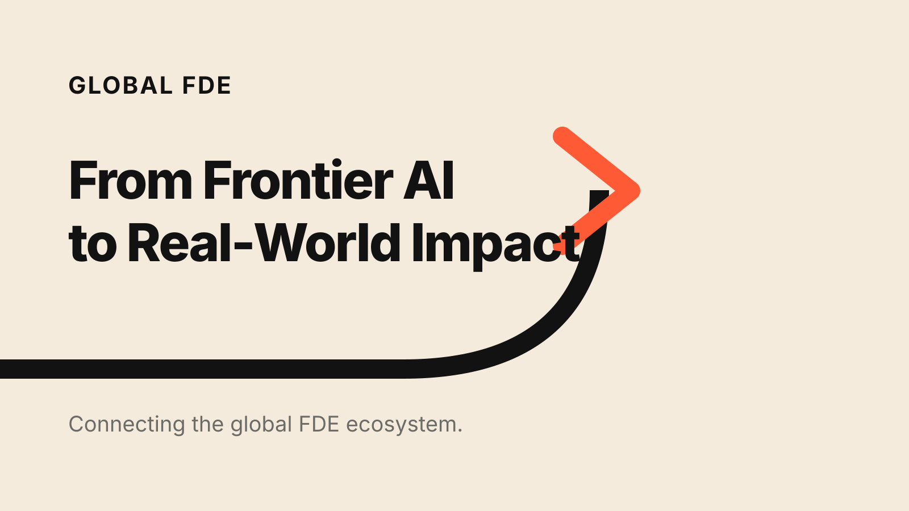

# Awesome Global FDE

> A curated collection of resources, tools, practices, case studies, and
> opportunities for Forward Deployed Engineers.

**Awesome Global FDE** is the open knowledge base of [Global FDE](https://github.com/global-fde),
the trusted connection layer for the global Forward Deployed Engineer ecosystem.
It focuses on the work between frontier technology and measurable production
outcomes: discovery, architecture, implementation, adoption, evaluation,
security, operations, and reusable field knowledge.

中文：面向前沿部署工程师（FDE）的精选资料库，关注如何把 AI 和前沿技术带进真实业务、生产环境与组织工作流，并形成可验证、可复用的结果。

## Global FDE headquarters

This repository is the public headquarters of Global FDE: a starting point
for practitioners, enterprises, partners, researchers, and contributors who
care about production AI and real-world deployment.

| Enter here | What you will find |
| --- | --- |
| [Mission, vision, and values](MISSION.md) | Why Global FDE exists and what we believe |
| [200 GitHub repositories](GITHUB_REPOSITORIES.md) | FDE books, guides, best practices, cases, and production tools |
| [Curated knowledge base](#contents) | FDE methods, production AI, agents, evaluation, security, cases, and careers |
| [Community programs](#global-fde-programs) | Field Notes, Briefing, FDE Table, Demo Day, and Office Hours |
| [Contribution guide](CONTRIBUTING.md) | How to submit a credible resource or field lesson |
| [Roadmap](ROADMAP.md) | What the community is building next |

### Two ways to contribute knowledge

| Resource type | Use it when | Location |
| --- | --- | --- |
| **Curated external link** | The canonical resource already lives on GitHub, an official website, a publisher site, or a standards body | Add a concise entry to this README and metadata to [`resources/links.yml`](resources/links.yml) |
| **Hosted Global FDE resource** | You created the material or have explicit permission to publish it under a compatible license | Submit the file and source record under [`library/`](library/README.md) |

External resources remain under their original owners' licenses. Do not copy a
linked book, report, course, or repository into this project merely because it
is publicly readable.

### What is a Forward Deployed Engineer?

A Forward Deployed Engineer works at the intersection of technology, customer
context, and production delivery. The role combines discovery, software and AI
engineering, system design, security, adoption, evaluation, and product
feedback. Success is measured not by a demo, but by whether a system enters the
real workflow, is trusted and used, produces a measurable outcome, and leaves
behind reusable capability.

前沿部署工程师站在技术、业务与真实现场之间。FDE 不只负责把模型或软件“接进去”，还要完成需求发现、系统设计、工程实现、生产上线、用户采用、效果评估和经验沉淀，对真实结果负责。

## Contents

- [Start here](#start-here)
- [FDE GitHub repository collection](#fde-github-repository-collection)
- [The FDE role and discipline](#the-fde-role-and-discipline)
- [Field discovery and delivery](#field-discovery-and-delivery)
- [Production AI and agents](#production-ai-and-agents)
- [Evaluation and observability](#evaluation-and-observability)
- [Security, governance, and risk](#security-governance-and-risk)
- [Cases and field evidence](#cases-and-field-evidence)
- [Careers and organizations](#careers-and-organizations)
- [Chinese-language resources](#chinese-language-resources)
- [Community](#community)
- [Global FDE programs](#global-fde-programs)
- [Contributing](#contributing)

## Start here

- [Global FDE Mission, Vision, and Values](MISSION.md) — Why this repository
  exists and the principles behind its curation.
- [OpenAI: Forward Deployed Engineer](https://openai.com/careers/forward-deployed-engineer-seoul-seoul-south-korea/)
  — A current description of end-to-end frontier-model deployment work, from
  discovery and scoping through rollout, adoption, and field feedback.
- [OpenAI for Singapore](https://openai.com/index/introducing-openai-for-singapore/)
  — An example of FDE capability becoming part of a national applied-AI and
  talent strategy.
- [Palantir careers](https://www.palantir.com/careers/open-positions/) — Roles
  and first-party material from the organization that established the
  forward-deployed engineering model in commercial software.

## FDE GitHub repository collection

The [FDE GitHub Repository Collection](GITHUB_REPOSITORIES.md) indexes **200
repositories** in four practical groups:

| Category | Repositories | Focus |
| --- | ---: | --- |
| Getting started | 85 | FDE books, handbooks, roadmaps, courses, interview preparation, and foundational AI engineering |
| Best practices | 25 | Discovery, delivery, production agents, evaluation, security, operations, and reusable methods |
| Cases and reference implementations | 15 | Simulations, workshops, enterprise examples, and end-to-end projects |
| Tools and infrastructure | 75 | Agent platforms, MCP, evaluation, observability, guardrails, sandboxing, RAG, and deployment |

The snapshot distinguishes **65 repositories directly about FDE** from **135
supporting production-AI repositories**. The machine-readable catalog lives in
[`resources/github-repositories.yml`](resources/github-repositories.yml), and
the reproducible discovery and selection scripts live under [`scripts/`](scripts/).
Repository inclusion is a discovery aid, not an endorsement; review the source,
license, maintenance status, and security posture before use.

## The FDE role and discipline

- [Anthropic and DXC alliance](https://www.anthropic.com/news/dxc-anthropic-alliance)
  — A large-scale example of forward-deployed engineers bringing AI into
  regulated, production-critical systems.
- [Palantir UK: Forward Deployed Software Engineer](https://www.palantir.com/uk/careers/)
  — Practitioner context on autonomy, customer proximity, and deploying
  software that works in consequential environments.

## Field discovery and delivery

This section is intentionally selective. We welcome field-tested playbooks for
problem discovery, stakeholder alignment, technical scoping, adoption, change
management, and turning one deployment into reusable product capability.

- [Structured-Prompt-Driven Development](https://martinfowler.com/articles/structured-prompt-driven/)
  — A reviewable and reusable method for capturing requirements, domain
  language, design intent, constraints, and safeguards in AI-assisted delivery.

## Production AI and agents

- [Building effective agents](https://www.anthropic.com/engineering/building-effective-agents)
  — Practical guidance on choosing between workflows and agents and keeping
  agent architectures understandable.
- [Model Context Protocol documentation](https://modelcontextprotocol.io/docs/getting-started/intro)
  — An open protocol for connecting AI applications to tools and context.
- [Palantir AI FDE](https://www.palantir.com/docs/foundry/ai-fde/overview)
  — A first-party example of agentic tooling applied to forward-deployed work.

## Evaluation and observability

- [OpenAI evaluation best practices](https://developers.openai.com/api/docs/guides/evaluation-best-practices)
  — Guidance for designing task-specific evals and continuously evaluating
  changes.
- [OpenTelemetry](https://opentelemetry.io/docs/) — Vendor-neutral telemetry
  standards for traces, metrics, and logs across production systems.

## Security, governance, and risk

- [Anthropic: Trustworthy agents in practice](https://www.anthropic.com/research/trustworthy-agents)
  — Field-oriented principles for human control, transparency, privacy, and
  secure agent interactions.
- [NIST AI Risk Management Framework](https://www.nist.gov/itl/ai-risk-management-framework)
  — A voluntary framework for governing, mapping, measuring, and managing AI
  risk across the lifecycle.
- [OWASP GenAI Security Project](https://genai.owasp.org/) — Open guidance for
  security risks in LLM and agentic applications.

## Cases and field evidence

- [Palantir DevCon](https://www.palantir.com/devcon/) — Production-oriented
  demonstrations and customer cases involving healthcare, industrial
  operations, agent systems, evaluation, and deployment infrastructure.

Case submissions should explain the operating context, constraint, system,
adoption path, and measured outcome. A polished demo without production
evidence is not a case study.

## Careers and organizations

- [OpenAI careers](https://openai.com/careers/search/) — Search for Forward
  Deployed Engineer, Forward Deployed Software Engineer, and related applied-AI
  roles.
- [Palantir open positions](https://www.palantir.com/careers/open-positions/) —
  Forward Deployed Software Engineer and Deployment Strategist roles across
  industries and regions.

We welcome links from other organizations when the role description clearly
covers field discovery, hands-on engineering, production rollout, adoption,
and measurable outcomes—not title-only use of “FDE.”

## Chinese-language resources

中文资料应注明作者、发布日期、原始出处和适用场景。案例应区分公开事实、来源观点和编辑判断；涉及客户、合同、数据或代码时必须获得授权并完成脱敏。

- [《前线部署工程师：人工智能时代的客户价值交付秘籍》](https://github.com/xdash/FDE-the-Guidance-Book-of-Forward-Deployed-Engineer)
  — 范冰（XDash）公开的中文 FDE 入门指南，沿着“解决正确的问题—赢得客户—激活部署—守住续约—扩大收入—规模化复制”的交付旅程组织内容，并附案例、指标与资料出处。原仓库允许免费阅读与非商业分享，版权及商业使用条件以作者声明为准。

> 这个分类正在持续建设。欢迎提交高质量中文报告、方法论、访谈、课程和生产案例。

## Community

- [Mission, Vision, and Values](MISSION.md)
- [Governance](GOVERNANCE.md)
- [Code of Conduct](CODE_OF_CONDUCT.md)
- [Contributing Guide](CONTRIBUTING.md)
- [Resource model](resources/README.md)
- [Hosted library](library/README.md)

Global FDE connects enterprises, FDEs, AI product and engineering teams,
delivery partners, technology providers, and domain experts. This repository
is the public knowledge layer of that ecosystem; it is not a paid placement
directory or a generic AI news feed.

## Global FDE programs

| Program | Purpose |
| --- | --- |
| **Global FDE Briefing** | Curated field intelligence on FDE, enterprise AI, agents, and AI infrastructure |
| **Global FDE Field Notes** | Deployment cases, architectures, methods, and honest postmortems |
| **Global FDE Table / FDE 小饭桌** | Small practitioner gatherings around one real problem, without pitches |
| **Global FDE Demo Day** | Working production systems and technical reviews—not slideware |
| **Global FDE Office Hours** | Peer review for architecture, delivery, adoption, and evaluation problems |

The repository will progressively publish reusable templates, reading paths,
case indexes, original research, and contributor-maintained regional and
industry collections. See the [roadmap](ROADMAP.md).

## Contributing

Contributions are welcome. Please read the [contribution guidelines](CONTRIBUTING.md)
before opening an issue or pull request.

In short:

1. Submit primary, durable, and practitioner-useful sources.
2. Explain why the resource matters to an FDE.
3. Disclose employment, investment, referral, or commercial relationships.
4. Do not submit affiliate links, lead-generation pages, or context-free promotion.

## License

The repository's original content is available under the
[Apache License 2.0](LICENSE). Linked resources remain subject to their
respective owners' terms and licenses.
